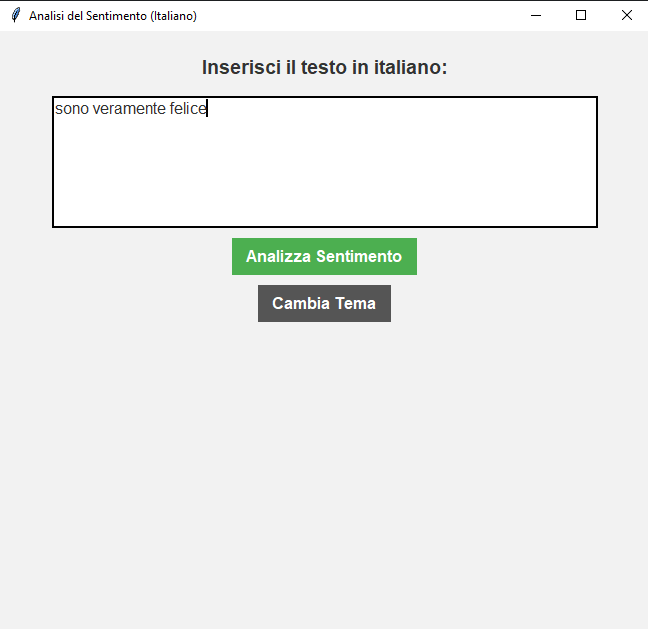
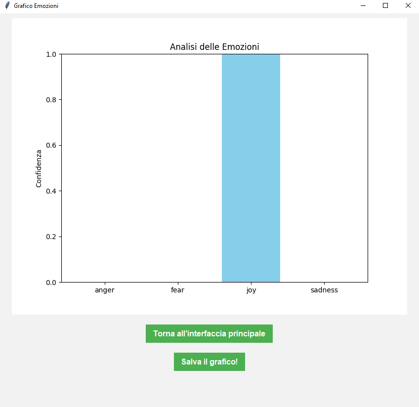
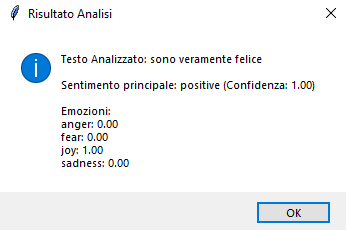

  
  
    
  <i>First experiment with Machine Learning & AI applied to Sentiment Analysis in Italian, 
  using Hugging Face models and a simple Tkinter GUI.</i>

---

# 📖 Index
- 📌 [Overview](#-overview)  
- 📥 [Download & Installation](#-download--installation)  
- 📷 [Usage Examples](#-usage-examples)  
- 📄 [License](#-license)  

---

# 📌 Overview

**Sentiment Analyzer** is my **first personal project** exploring the world of **Machine Learning and Natural Language Processing (NLP)**.  

It is a simple **desktop application** (built with **Python + Tkinter**) that analyzes:  
- **Sentiment** → *positive / negative / neutral*  
- **Emotions** → *joy, sadness, anger, fear*  

All in **Italian language** 🇮🇹.  

The app integrates **Hugging Face Transformers pipelines**, allowing users to analyze text through an intuitive graphical interface.  

---

# 📥 Download & Installation

**⚠️ Python 3.x is required on the machine to run this app.**

1. Download the latest SentimentAnalyzer folder (includes all files and the batch file).
2. Make sure Python 3.x is installed and added to your system PATH.
3. Open the folder and double-click run_sentiment_analyzer.bat to start the application.

On first run, the batch file will install the required Python packages (from requirements.txt) and download the Hugging Face models (Internet connection required).
After that, the app works offline.

---
# 📷 Usage Examples

### App Interface  
 
The user writes an Italian text, then clicks **"Analizza Sentimento"**.  

### Example Output  

  
**Testo Analizzato:**  
`Oggi è una giornata fantastica!`  

**Sentimento principale:**  
`positivo (Confidenza: 0.92)`  
  
  
**Emozioni:**  
- Gioia → 0.88  
- Tristezza → 0.03  
- Rabbia → 0.04  
- Paura → 0.05  

---

# 📄 License

Released under the **MIT License**.  
Feel free to use, modify, and share 🚀
